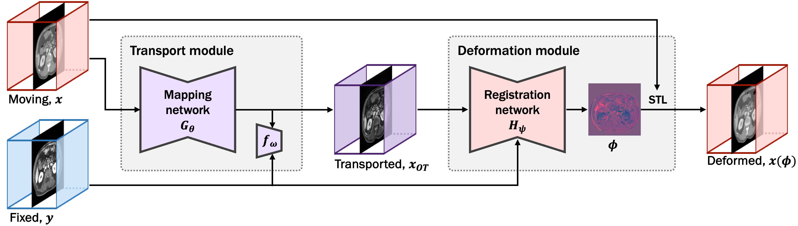

# OTMorph
Official repository for "OTMorph: Unsupervised Multi-domain Abdominal Medical Image Registration Using Neural Optimal Transport", published in IEEE Transactions on Medical Imaging.

[[IEEE TMI paper](https://ieeexplore.ieee.org/abstract/document/10621700)]



## Installation
To test the proposed OTMorph, we may need Conda environment. You can download Anaconda from this [link](https://www.anaconda.com/download).
Then, please run:
```
conda env create -f OTMorph.yml
```

## Train

To train our model, run this command:

```train
sh ./scripts/train.sh
```

## Test

To test the trained our model, run:

```eval
sh ./scripts/test.sh
```

When you run the code, "./results" folder is generated. And the registration results are saved in this directory.


Citation
===============
```
@article{kim2024otmorph,
  title={OTMorph: Unsupervised Multi-domain Abdominal Medical Image Registration Using Neural Optimal Transport},
  author={Kim, Boah and Zhuang, Yan and Mathai, Tejas Sudharshan and Summers, Ronald M},
  journal={IEEE Transactions on Medical Imaging},
  year={2024},
  publisher={IEEE}
}
```
